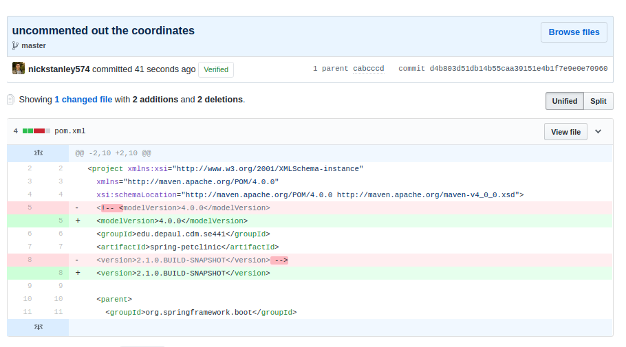

Nicholas Stanley (1353158)

### DOCKER
1. [5 pts] Your dockerfile. Please provide a link to this file rather than a screen capture.
- https://github.com/nickstanley574/spring-petclinic/blob/master/Dockerfile
2. [5 pts] Your running docker instance as shown by a ps command.
- 
3. [5 pts] Your browser accessing the main page of the website from your local container.
- 

___

1. [5 pts] Your Github account showing that is has been forked from the depaulcdm/springpetclinic repository.
- 
2. [5 pts] Your Travis CI dashboard showing a successful first build.
- 
3. [5 pts] The section of the POM file showing the coordinates after you’ve changed them.
- 
4. [5 pts] Your Travis CI dashboard showing a successful build after your change of the groupID.
- 
5. [5 pts] The section of the POM file showing the coordinates after you’ve commented themout.
- 
6. [5 pts] Your Travis CI dashboard showing the unsuccessful build after the breaking change.
- 
7. [5 pts] Your Github repository with the readme.md file selected showing the build failed status after the Travis CI build fails.
- 
8. [5 pts] The section of the POM file showing the coordinates after you’ve fixed them.
- 
9. [5 pts] Your Travis CI dashboard showing the successful build after the breaking change has been fixed.
- 
10. [5 pts] Your Github repository with the readme.md file selected showing the build success status after the Travis CI build has recovered.
- 
